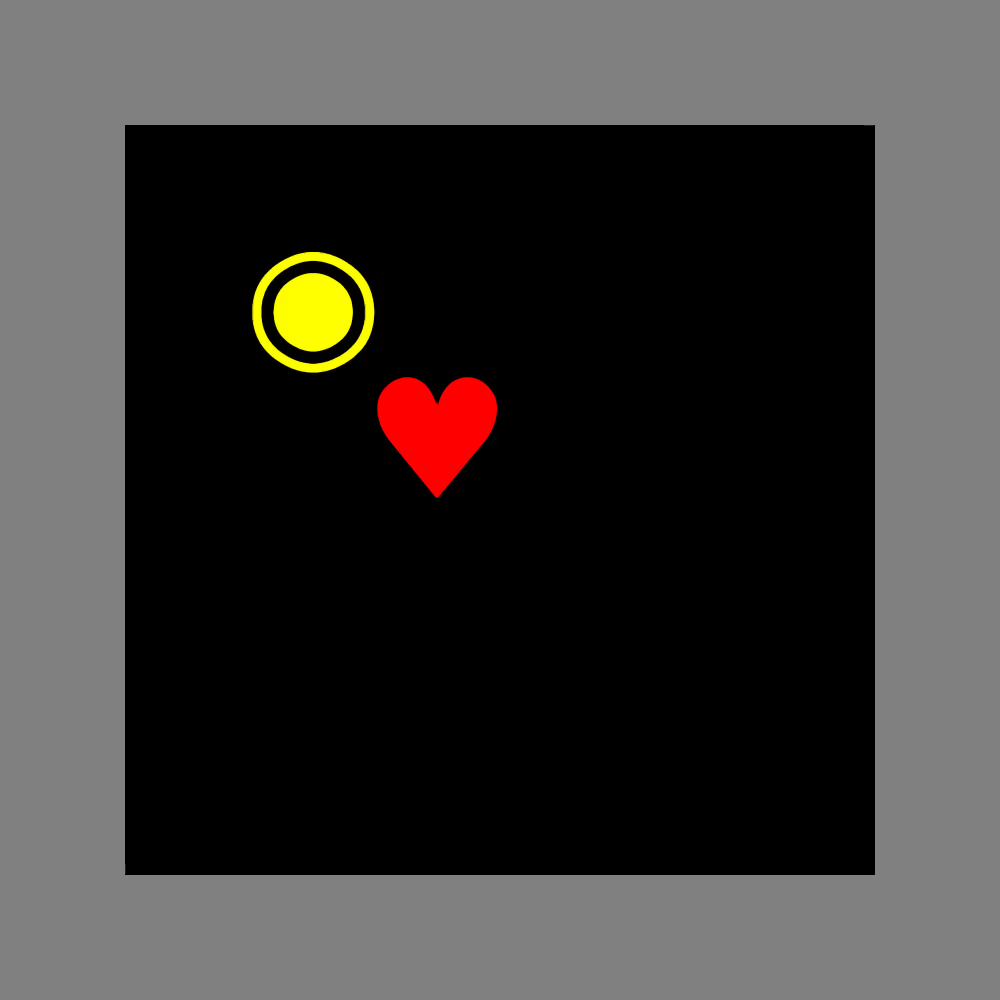

Please see more games in [GridWorlds.jl](https://github.com/JuliaReinforcementLearning/GridWorlds.jl)

# SnakeGames

[](https://JuliaReinforcementLearning.github.io/SnakeGames.jl/stable)
[](https://JuliaReinforcementLearning.github.io/SnakeGames.jl/dev)
[](https://travis-ci.com/JuliaReinforcementLearning/SnakeGames.jl)

This package provides some basic variants of the [snake game](https://en.wikipedia.org/wiki/Snake_(video_game)).

## Basic Usage

```julia
pkg> add SnakeGames

julia> using SnakeGames

julia> play()
```

Single snake and single food. The snake can move through the boundary.


<hr>

```julia
game = SnakeGame(;walls=[
    CartesianIndex.(1, 1:8)...,
    CartesianIndex.(8, 1:8)...,
    CartesianIndex.(1:8, 1)...,
    CartesianIndex.(1:8, 8)...]) 

play(game)
```

Add boundaries to the game. The game stop when the snake hits the wall.



<hr>

```julia
game = SnakeGame(;n_snakes=2)

play(game)
```

2 snakes and 1 food. Game stop when two snake eat the same food.


<hr>

A known bug is that, two snakes of length 1 can move across each other.


<hr>

```julia
game = SnakeGame(;n_snakes=3, n_foods=5)

play(game)
```

3 snakes and 5 foods. Game stop when one snake hits another.


<hr>

In fact, we can have many snakes and foods.


And even in the 3D mode. (TODO: add a picture.)

## Inner Representation

By default, a vector of `2*n_snakes+2` bits is used to represent the current state of each grid.

- The first `n_snakes` bits are used to mark which snakes' head occupy the grid.
- The following up `n_snakes` bits are used to mark which snakes' body occupy the grid.
- The last two bits are used to mark whether this grid is occupied by wall/food or not.

You can access it via `game.board` and use it in your own algorithms.
